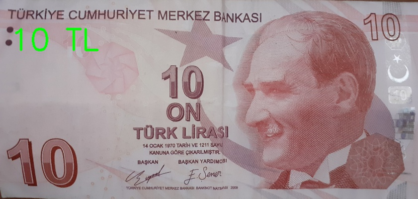
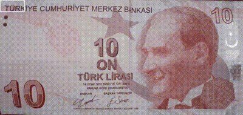

# MoneyDetection

This project is a classification implementation. <br>
For beginners, the implementation can be helpful, but it is simple for other levels.

## The purpose

Purpose of this project is detect value of a money in a image, and put the value top left of the image.



## What have done for the purpose?


### Image spliting

Main aim of this part of project is split a image of money different parts which are different size, and resize it with choosen values, and save it.

This approach maybe is not bad, but the code is not efficient.



---

### Training a model

I tried `KNN`, `SVM` as classifier, and `HOG`, `LBP` as feature extraction. 
I used `scikit-learn` for classifier, and `scikit-image` for feature extraction.
After training process, I saved the model in `.pkl` file with `pickle`.

| | **KNN** | **SVM** | 
| :---: | :---: | :---: | 
| **LBP** | 0.8864295125164691 | 0.6671936758893281 |
| **HOG** | 0.847957839262187 | 0.7820816864295125 |

````
knnTrain.py

for every images
    exctract features nad save to a list
split the list to trainig, and test
pass training to the classfier
check score with test data
save the model
````

---

### Test the model

After training, The code is able to use the `.pkl` file.
`knnTest.py` does the almost similar thing with training. <br>
It takes the model, and the image in given path. <br>
It splits the image, but this spliting process making lesser parts than `Split.py`, because I want to it be faster. <br>
It extracts feature. <br>
It makes a prediction every splitted image and store in a list. <br>
After that, It scan the list for checking which prediction there are more, and put the prediction in the image 

---
